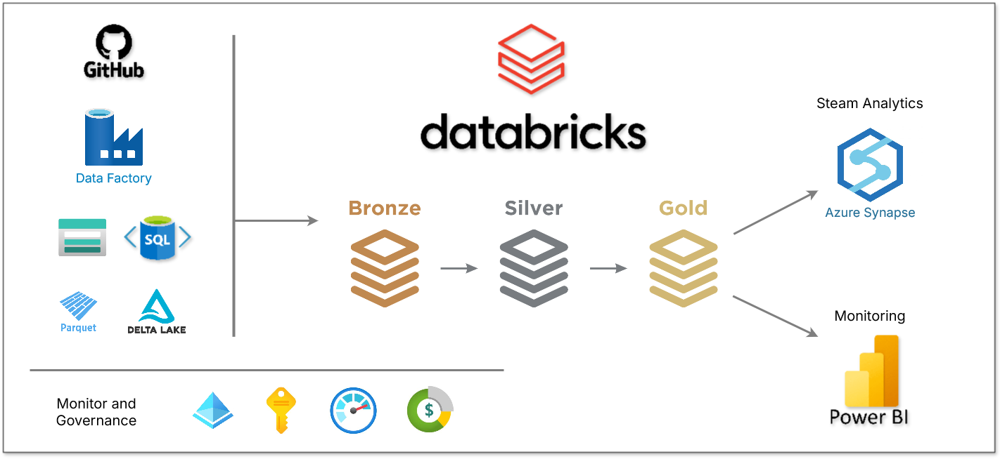

# Azure Data Engineering Project
An end-to-end ETL pipeline implementing **bronze-silver-gold**  architecture on Azure



## 📌 Architecture Overview
1. **Extract**: GitHub → Azure SQL DB (via Data Factory)
2. **Bronze**: Raw data landing in Azure Data Lake
3. **Silver**: Databricks transformations (cleaning, validation)
4. **Gold**: Delta Lake star schema with SCD Type 1 UPSERT
5. **Visualization**: Power BI with live Databricks connection

## 🛠️ Technologies Used
| Technology | Purpose |
|------------|---------|
| Azure Data Factory | Orchestration & data movement |
| Azure Databricks | Data transformation (PySpark/SQL) |
| Delta Lake | ACID transactions in Gold layer |
| Azure SQL DB | Initial data staging |
| Azure Blob Storage | Data Lake implementation |
| Power BI | Analytics & visualization |


## 📂 Repository Structure
```
azure-databrics-ETL-Pipeline/
├── Incremental_pipeline/   # Data Factory pipelines & JSON definitions
├── notebooks/              # Notebooks for each layer
│ ├── silver/               # Raw → Cleaned transformations
│ └── gold/                 # Business-ready datasets
├── rawdata/                # DataSource
├── docs/                   # Architecture diagrams & documentation
└── scripts/                # Connection/utility scripts
```


## 🚀 Pipeline Architecture
```
▌ Extraction Phase
├─ Azure Data Factory copies from GitHub → Azure SQL DB
└─ Initial schema validation applied

▌ Bronze Layer (Raw)
├─ ADF lands data in Azure Storage (Parquet)
└─ Partitioned by ingestion date

▌ Silver Layer (Cleaned)
├─ Databricks notebooks transform raw data:
│  ├─ Reading and Schema validation
│  ├─ Transformation
│  └─ Data Writing
└─ Output: Validated Parquet files

▌ Gold Layer (Business Ready)
├─ Delta Lake tables with SCD Type 1 logic
├─ Star schema implementation:
│  ├─ Fact tables (metrics)
│  └─ Dimension tables (context)
└─ Optimized for Power BI queries

▌ Visualization
└─ Power BI DirectQuery to Delta tables
```

## Key Features

### Medallion Architecture Implementation
- Bronze: Immutable raw data layer
- Silver: Validated business entities
- Gold: Optimized analytics tables

### Slowly Changing Dimensions (Type 1) Implementation
```
deltatable.alias('t').merge(df_fact.alias('s'),\
        t.dim_branch_key == s.dim_branch_key and \
        t.dim_dealer_key == s.dim_dealer_key and \
        t.dim_model_key == s.dim_model_key and \
        t.dim_date_key == s.dim_date_key)\
                .whenMatchedUpdateAll()\
                .whenNotMatchedInsertAll()\
                .execute()
```


## Azure DataBrics Model Execution


## Azure DataFactory Pipeline


## 📊 Sample Output

### Gold Layer Data Model
Star Schema

### Power BI Dashboard
Visualization

## 🛠️ Setup Instructions
Prerequisites
- Azure subscription
- Contributor access to:
  - Data Factory
  - Databricks workspace
  - Storage Account


## 🤝 Contributing
- Fork the project
- Create your feature branch (git checkout -b feature/improvement)
- Commit changes (git commit -m 'Add new transformation')
- Push to branch (git push origin feature/improvement)
- Open a Pull Request