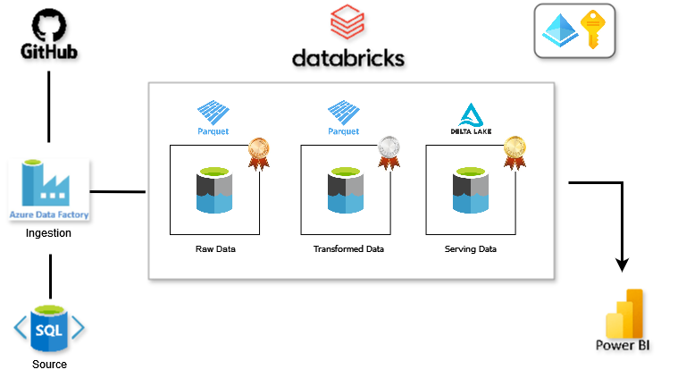
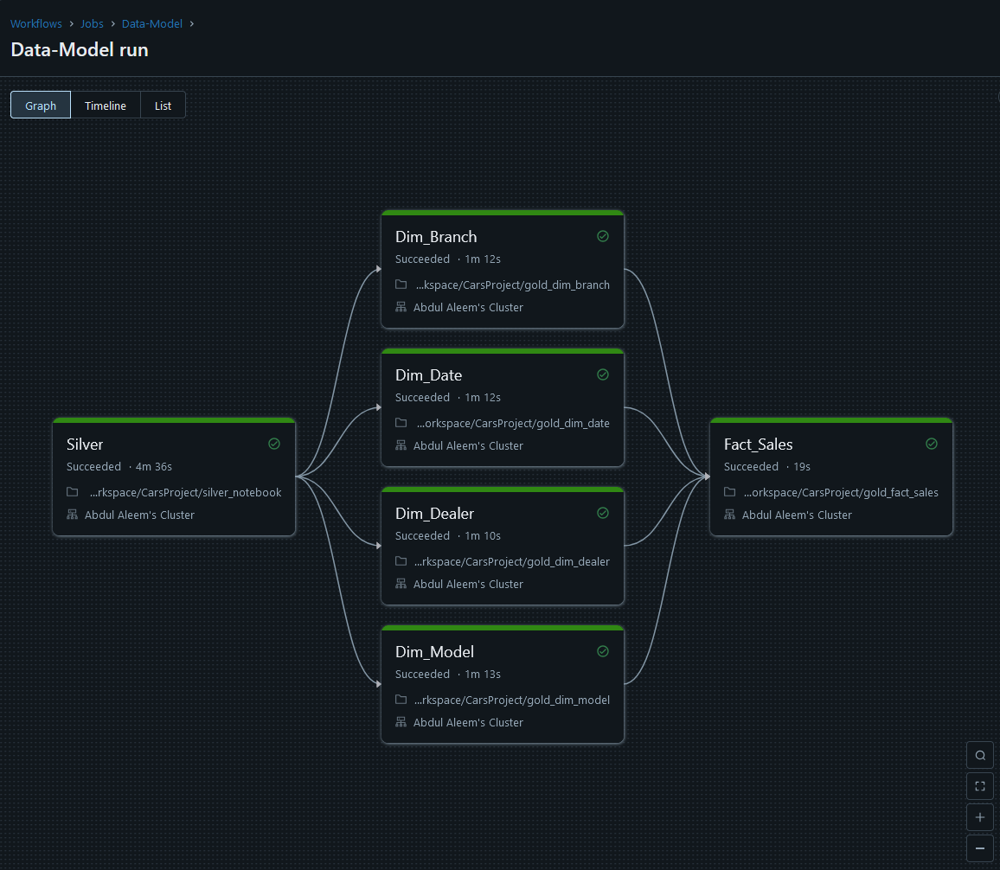
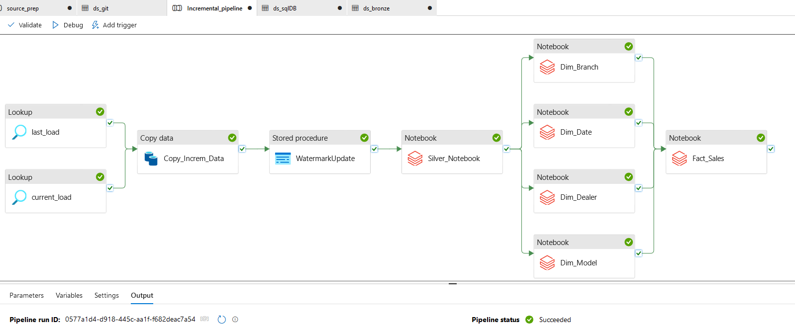

# Azure Data Engineering Project
Production-grade ETL pipeline on Azure transforming raw GitHub data into analytics-ready star schema
## Architecture Overview

**Pipeline Flow**:
1. **Extract**: GitHub → Azure SQL DB (via ADF)
2. **Bronze**: Raw data landing in Azure Data Lake
3. **Silver**: Transformation in Databricks (Parquet)
4. **Gold**: Star schema with Delta Lake (SCD Type 1)
5. **Visualization**: Power BI integration

## Technologies Used

- **Azure Data Factory**: Orchestration and initial data movement
- **Azure Databricks**: Data transformation (PySpark/SQL)
- **Delta Lake**: Gold layer with ACID transactions
- **Power BI**: Visualization and analytics
- **Azure Storage**: Data Lake implementation

## Azure DataBrics Pipeline

## Azure DataFactory Pipeline

